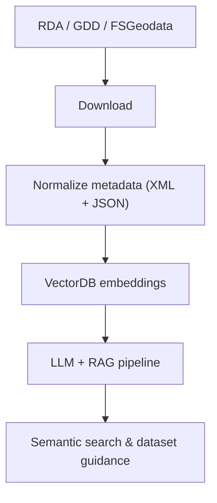

# Catalog

Catalog is a Python command-line-interface (CLI) that automates discovery and understanding of Forest Service geospatial and tabular data. It harvests XML metadata and MapServer service definitions from three anonymized portals—Research Data Archive (RDA), Geospatial Data Discovery (GDD), and FSGeodata Clearinghouse (FSGeodata)—builds embeddings, and allows the user to explore datasets with a semantic, RAG-powered search that can answer questions like “What data exists and how do I use it?”.

## Why it matters

- Hunting across portals, downloading XML one-by-one, and reconciling service URLs slows research and product teams.
- Explaining lineage and “fit for purpose” to stakeholders is hard without a unified view.
- Traditional keyword search misses nuance; semantic search with LLMs locates relevant datasets faster.

## What Catalog does

- Automated harvesting from RDA, GDD, and FSGeodata (XML + MapServer JSON).
- Embeds metadata with a vector database (table) and uses LLMs in a Retrieval-Augmented Generation (RAG) flow for semantic Q&A.
- Outputs organized metadata and service URLs you can plug into dashboards or analyses.

## The process (at a glance)

  1. Identify metadata sources:  
    - Research Archive (RDA): research-grade datasets from the agency's research directory.  
    - Geospatial Discovery (GDD): current operational GIS layers and services.  
    - FSGeodata Clearinghouse (FSGeodata): authoritative basemaps, boundaries, operational layers, and raster products.

  2. Harvest metadata: `uv run catalog download-fs-metadata` pulls XML and MapServer JSON, normalizes fields, and stores metadata for indexing.

  3. Build the vector database (chromadb): embeddings go into vector storage; metadata stays linked.

  4. RAG-based search: the CLI uses the embeddings plus an LLM to answer dataset and lineage questions with grounded citations.

## Where to go next

- Vision and philosophy: see `docs/vision.md`.
- Disclaimer and project status: see `docs/disclaimer.md`.
- Architecture and design decisions: see `docs/architecture.md`.
- Data sources deep dive: see `docs/data-sources.md`.
- CLI usage and examples: see `docs/cli.md`.
- Vector DB details and comparisons: see `docs/vector-db.md`.
