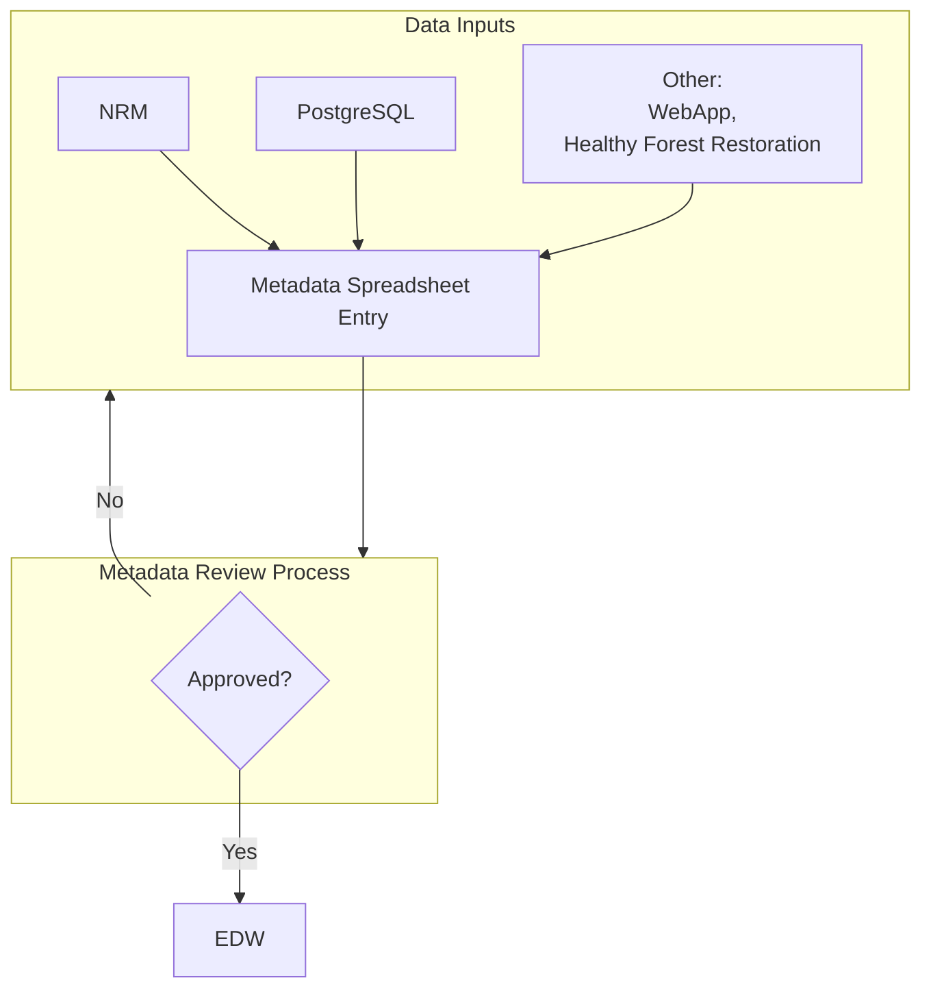

```mermaid

flowchart TB
  subgraph DataInputs[Data Inputs]
      direction TB
      NRM --> MetadataSpreadsheetEntry[Metadata Spreadsheet Entry]
      PostgreSQL --> MetadataSpreadsheetEntry
      Other[
        Other:
        WebApp, 
        Healthy Forest Restoration
      ] --> MetadataSpreadsheetEntry
      MetadataSpreadsheetEntry
  end

  subgraph Review[Metadata Review Process]
    ReviewDecision{Approved?}
  end
  
  ReviewDecision --> |Yes| EDW
  ReviewDecision ----> |No| DataInputs
  MetadataSpreadsheetEntry --> Review
```
