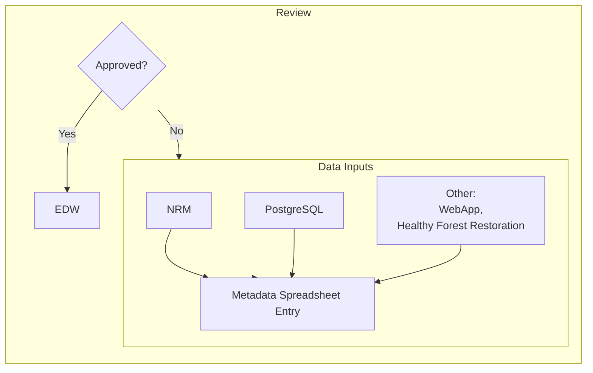

```mermaid

flowchart TB
  subgraph DataInputs[Data Inputs]
      direction LR
      NRM --> MetadataSpreadsheetEntry[Metadata Spreadsheet Entry]
      PostgreSQL --> MetadataSpreadsheetEntry
      Other[
        Other:
        WebApp, 
        Healthy Forest Restoration
      ] --> MetadataSpreadsheetEntry
      MetadataSpreadsheetEntry
  end

  subgraph Review
    Approval@{shape: diamond, label: "Approved?"}
    Approval --> |Yes| EDW
    Approval --> |No| DataInputs
  end

  MetadataSpreadsheetEntry --> Review
```
