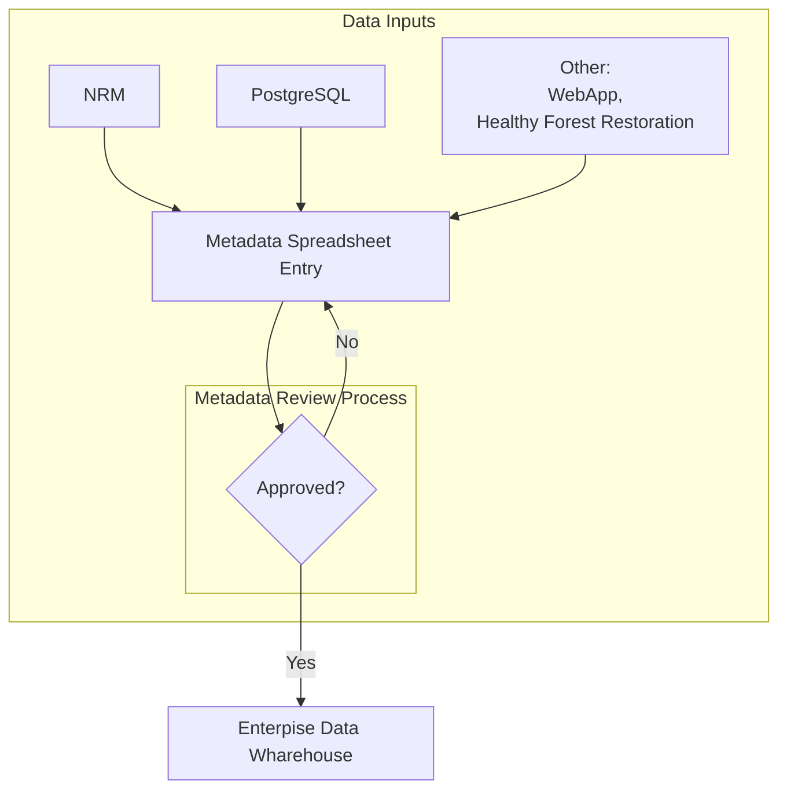

```mermaid

flowchart TB
  subgraph DataInputs[Data Inputs]
      direction TB
      NRM --> MetadataSpreadsheetEntry[Metadata Spreadsheet Entry]
      PostgreSQL --> MetadataSpreadsheetEntry
      Other[
        Other:
        WebApp, 
        Healthy Forest Restoration
      ] --> MetadataSpreadsheetEntry
      MetadataSpreadsheetEntry

      subgraph Review[Metadata Review Process]
        ReviewDecision{Approved?}
      end
  end

  subgraph EDW[Enterpise Data Wharehouse]
  end
  
  ReviewDecision --> |Yes| EDW
  ReviewDecision --> |No| MetadataSpreadsheetEntry
  MetadataSpreadsheetEntry --> ReviewDecision
```
