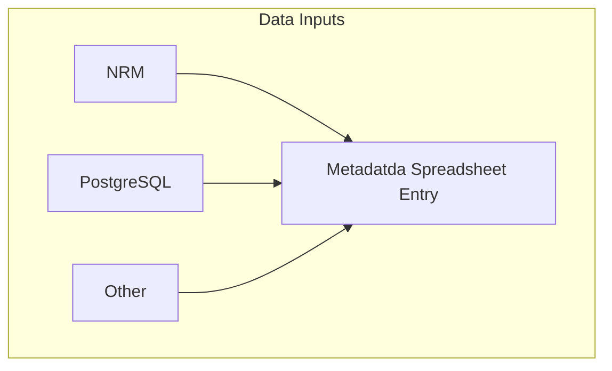

```mermaid

flowchart TB
  subgraph DataInputs[Data Inputs]
      direction LR
      NRM
      PostgreSQL
      Other
      MetadataSpreadsheetEntry[Metadatda Spreadsheet Entry]
  end

  NRM --> MetadataSpreadsheetEntry
  PostgreSQL --> MetadataSpreadsheetEntry
  Other --> MetadataSpreadsheetEntry
  
```
