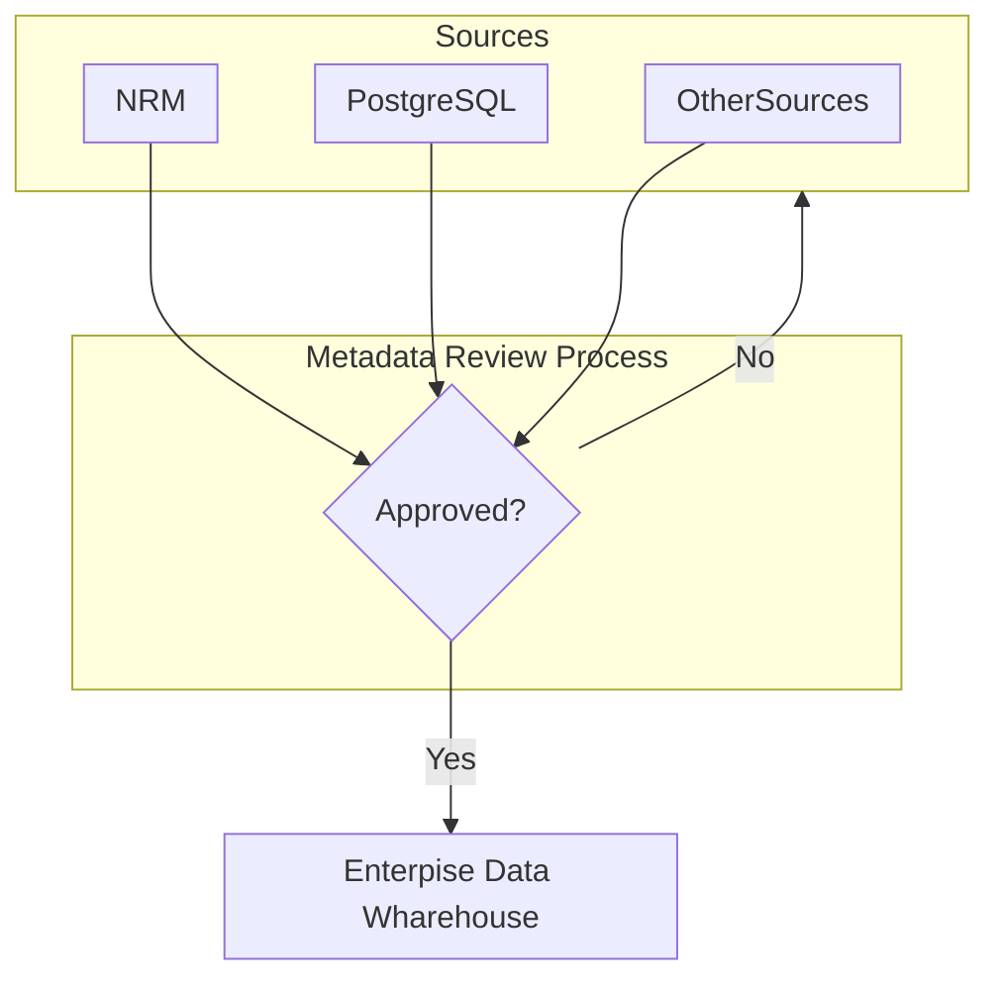

```mermaid

flowchart
  direction TB

  subgraph Sources
    subgraph NRM
    end
    
    subgraph PostgreSQL
    end

    subgraph OtherSources
    end
  end

NRM --> ReviewDecision
PostgreSQL --> ReviewDecision
OtherSources --> ReviewDecision

subgraph Review[Metadata Review Process]
  ReviewDecision{Approved?}
end

subgraph EDW[Enterpise Data Wharehouse]
end
  
ReviewDecision --> |Yes| EDW
ReviewDecision --> |No| Sources
```
