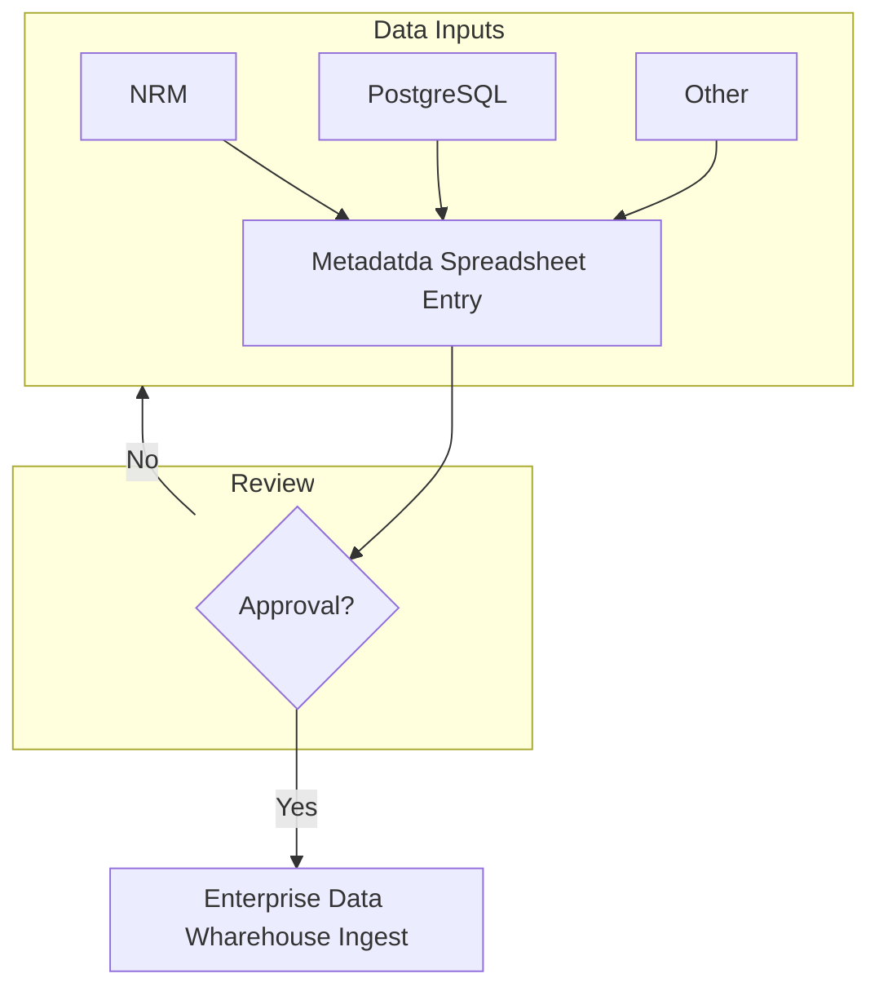

```mermaid

flowchart TB
  subgraph DataInputs[Data Inputs]
      direction LR
      NRM
      PostgreSQL
      Other
      MetadataSpreadsheetEntry[Metadatda Spreadsheet Entry]
  end

  NRM --> MetadataSpreadsheetEntry
  PostgreSQL --> MetadataSpreadsheetEntry
  Other --> MetadataSpreadsheetEntry

  subgraph Review
    direction TB
    A@{ shape: diamond, label: "Approval?" }      
  end

  subgraph EDW[Enterprise Data Wharehouse Ingest]
  end

  MetadataSpreadsheetEntry --> A
  A --> |Yes| EDW
  A --> |No| DataInputs
  
```
