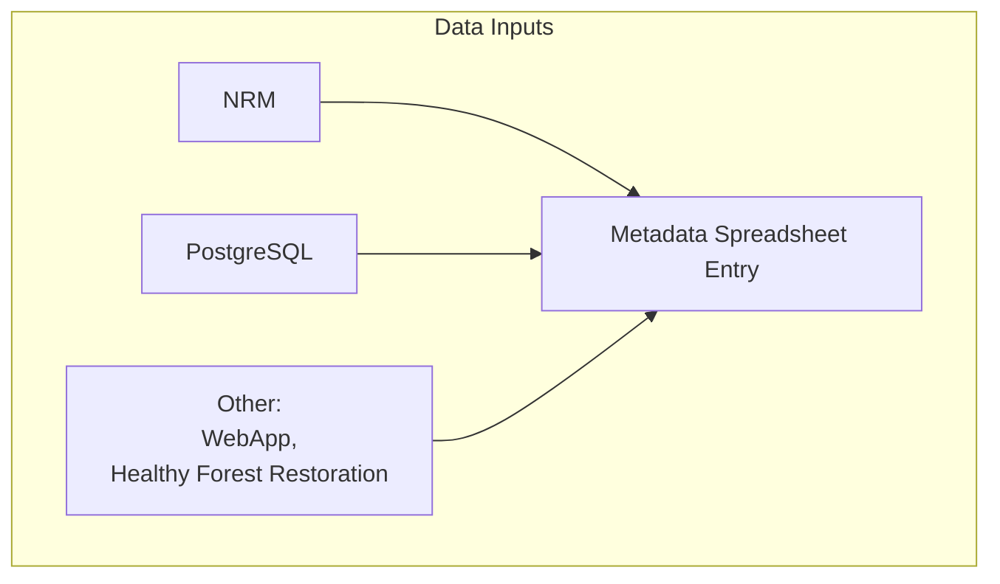

```mermaid

flowchart TB
  subgraph DataInputs[Data Inputs]
      direction LR
      NRM --> MetadataSpreadsheetEntry[Metadata Spreadsheet Entry]
      PostgreSQL --> MetadataSpreadsheetEntry
      Other[
        Other:
        WebApp, 
        Healthy Forest Restoration
      ] --> MetadataSpreadsheetEntry
      MetadataSpreadsheetEntry
  end
```
