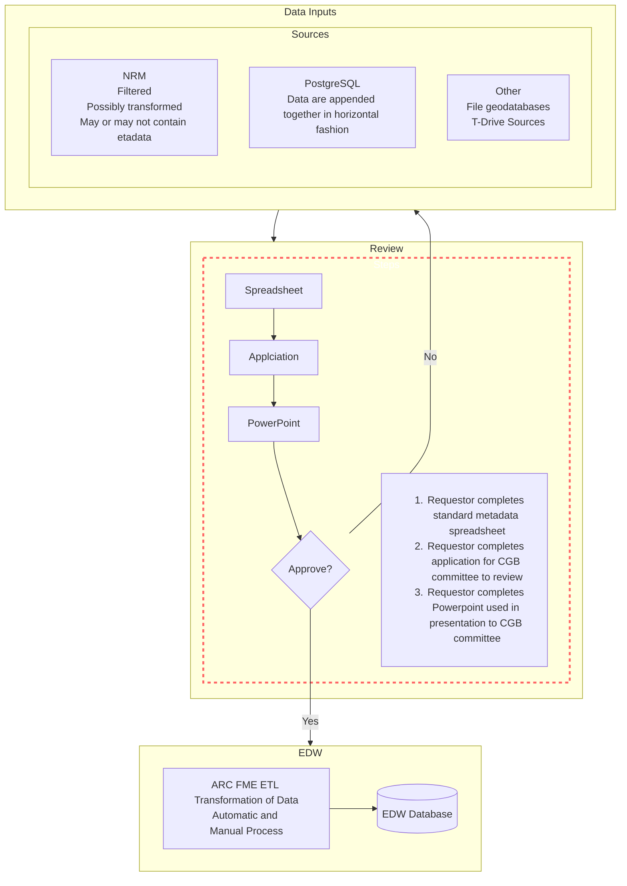

```mermaid

graph TB
  subgraph Inputs[Data Inputs]
    subgraph Sources
      NRM["NRM<br/>Filtered<br/>Possibly transformed<br/>May or may not contain etadata<br>"
      ]
      PgSQL["PostgreSQL<br/>Data are appended together in horizontal fashion"]
      Other["Other<br/>File geodatabases<br/>T-Drive Sources"]
    end
  end

  subgraph Review[Review]
    direction LR
    
    subgraph Steps
      direction LR
      S[Spreadsheet]
      A[Applciation]
      P[PowerPoint]
      Approve{Approve?}
      D[<ol><li>Requestor completes standard metadata spreadsheet</li><li>Requestor completes application for CGB committee to review</li><li>Requestor completes Powerpoint used in presentation to CGB committee</li></ol>]
    end

    S --> A
    A --> P
    P --> Approve
  end
  style Steps stroke:#f66,stroke-width:3px,color:#fff,stroke-dasharray: 5 5
  
  subgraph EDW
    FME[ARC FME ETL Transformation of Data<br/>Automatic and <br/>Manual Process]
    FME --> EDWDatabase[(EDW Database)]
  end
  Approve --> |Yes| EDW
  Approve --> |No| Inputs

  Inputs --> Review

```