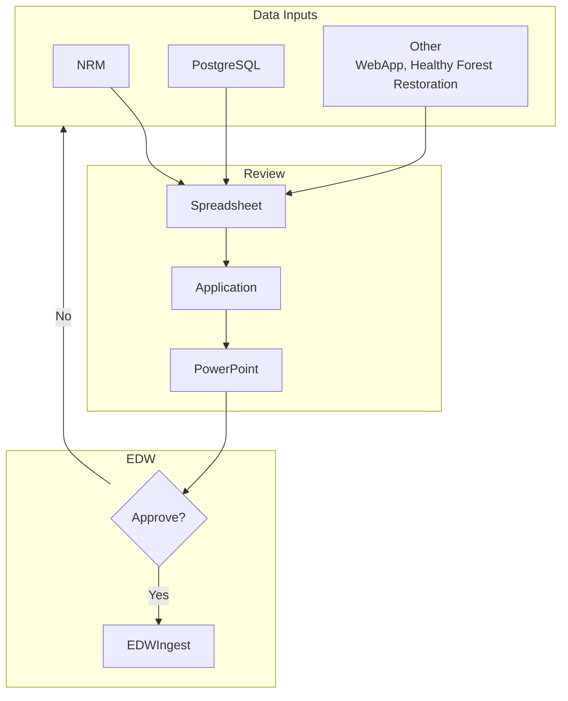

```mermaid

flowchart
  subgraph Inputs[Data Inputs]
      direction TB
      NRM
      PostgreSQL
      Other[Other<br>WebApp, Healthy Forest Restoration]     
  end

  subgraph Review
    direction LR
    Spreadsheet --> Application --> PowerPoint
  end

  NRM --> Spreadsheet
  PostgreSQL --> Spreadsheet
  Other --> Spreadsheet

  subgraph EDW
    Approve{Approve?}
    EDWIngest
  end

  PowerPoint --> Approve
  Approve --> |Yes| EDWIngest
  Approve --> |No| Inputs
```